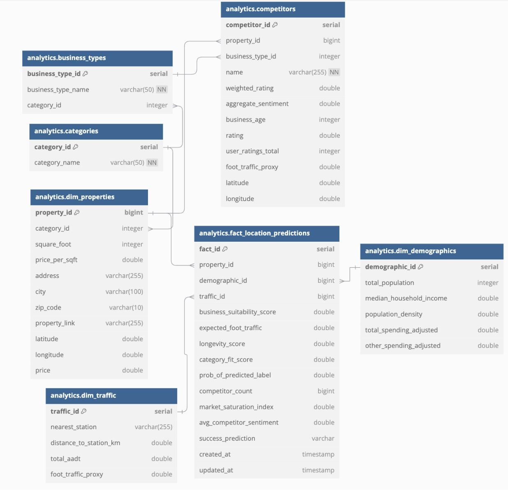
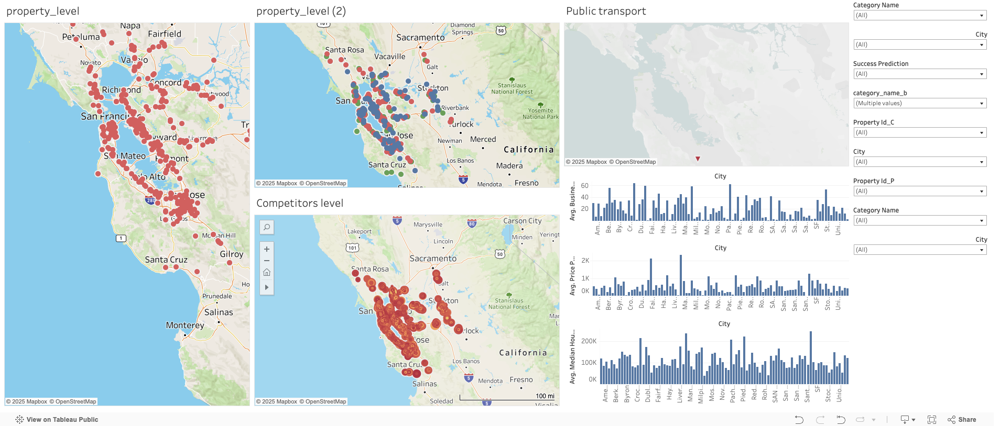

# **AI-Powered Business Location Feasibility Analysis**

This project leverages Artificial Intelligence (AI) and Machine Learning (ML) to provide actionable insights for selecting optimal business locations. By integrating data from multiple sources—such as demographics, traffic metrics, and competitor analysis—the project aims to predict the feasibility and success potential of a business at a given location.

---
# System Architecture

---
## **📊 About the Dataset**

This project combines multiple datasets to deliver comprehensive insights for location feasibility analysis:

- **Property Data**: Details such as price, square footage, property type, and geographic coordinates, sourced from CREXi.
- **Demographics Data**: Population density, income levels, and employment statistics, obtained from the U.S. Census Bureau API.
- **Traffic Data**: Average Daily Traffic (ADT) and proximity to public transport, sourced from the Google Maps API.
- **Competitor Data**: Information about nearby competitors, including business types, ratings, and reviews, collected from Google Places API and Yelp API.

---

## **📄 Project Contents**

### **1. Data Collection and Integration**
- APIs and public datasets were used to collect data for demographics, traffic, real estate, and competitors.
- Integration of diverse data sources ensures a holistic analysis of each location.

### **2. ETL Pipeline**
- Built using **AWS Glue** to automate data extraction, transformation, and loading into an Amazon RDS database.
- Key transformations include:
  - Cleaning and preprocessing raw data.
  - Performing sentiment analysis on reviews.
  - Calculating weighted ratings and aggregate sentiment.

### **3. Dimensional Modeling**
- Data is structured into a **star schema** with fact and dimension tables, enabling efficient querying and machine learning model training.

### **4. Machine Learning**
- **Advanced models** (e.g., Scikit-learn, TensorFlow) predict:
  - **Business Suitability Score** for given locations.
  - **Recommended Business Types** based on historical and real-time data.

#### **Input Features**:
- **Demographics**: Population density, income levels, employment statistics.
- **Traffic**: ADT and public transport proximity.
- **Real Estate**: Price, square footage, property type.
- **Competitor Data**: Ratings, reviews, and number of competitors.

#### **Output Features**:
- Business suitability score.
- Recommendations for optimal business types.

### **5. GIS and Visualization**
- Interactive maps visualize proximity to competitors, amenities, and transport hubs.
- Summarized recommendations powered by GPT API provide actionable insights.

---

## **🔍 Key Features**
- **Multi-Source Data Integration**: Comprehensive analysis by combining demographics, traffic, real estate, and competitor data.
- **Advanced Machine Learning Models**: Accurate predictions of business success potential.
- **GIS Integration**: Visual insights through interactive maps.
- **Actionable Insights**: Tailored recommendations for business types, backed by AI.

---

## **📌 Summary**

The project showcases a complete end-to-end workflow:
1. **Exploratory Data Analysis**: Understanding and cleaning data.
2. **ETL Pipeline**: Automating data preparation and storage in AWS RDS.
3. **Machine Learning Models**: Predicting success potential with advanced algorithms.
4. **Visualization**: Delivering insights through interactive maps and dashboards.

**Key insights**:
- **Demographics and Traffic** play crucial roles in determining business feasibility.
- **Competitor Analysis**, including ratings and sentiment from reviews, adds depth to the predictions.

---

## **🚀 Installation**

### **Prerequisites**
- Python 3.9+
- AWS account with Glue, S3, and RDS setup.
- Required Python libraries:
  - `pandas`, `scikit-learn`, `boto3`, `flask`

